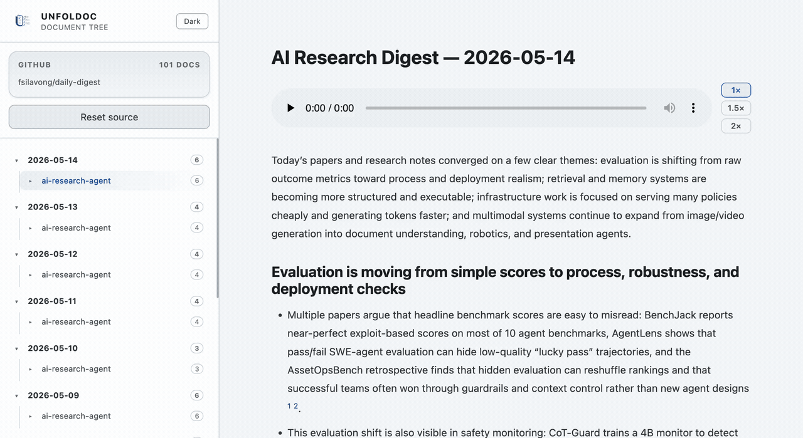
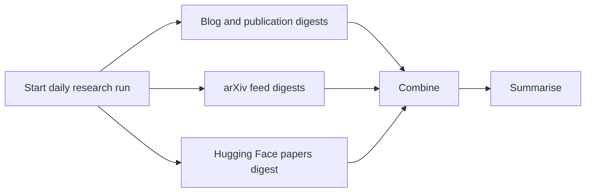

# Daily Digest

### The AI research world moves fast. This keeps you up.

**20+ top labs · arXiv · Hugging Face — summarised into one daily brief, automatically.**

**[📖 Read the latest digest →](https://unfoldoc.fly.dev/)**

 

--- 

No more tab overload. No more FOMO. Every morning, `ai-research-agent` crawls the frontier — papers, blog posts, model releases — and lands a single, skimmable digest. 

## High-Level Flow

## Data Sources

### Blog and publication sources

- `openai-research`
- `anthropic-research`
- `anthropic-alignment`
- `deepmind-publications`
- `google-research-blog`
- `meta-ai-blog`
- `mistral-news`
- `xai-news`
- `cohere-blog`
- `ai2-research`
- `ai2-papers`
- `bair-blog`
- `princeton-agents`
- `stanford-hai-news`
- `ibm-research-blog`
- `microsoft-research-blog`
- `microsoft-research-publications`
- `amazon-science-blog`
- `nvidia-generative-ai-blog`
- `huggingface-papers` when enabled

### arXiv RSS feeds

- `arxiv-cs-ai`
- `arxiv-cs-cl`
- `arxiv-cs-lg`
- `arxiv-cs-ir`
- `arxiv-cs-ma`
- `arxiv-cs-se`
- `arxiv-cs-hc`
- `arxiv-stat-ml`
