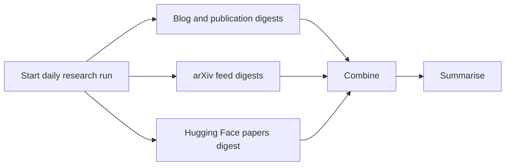

# Daily Digest

Deployed app: <https://unfoldoc.fly.dev/>

`ai-research-agent` writes one daily research bundle under:

```text
data/daily-digest/<YYYY-MM-DD>/ai-research-agent/
```

The deployed experience uses [`unfoldoc`](https://github.com/fsilavong/unfoldoc):
its skill helps generate the digest content, and its app renders the daily
digest view.

## High-Level Flow



## Data Sources

### Blog and publication sources

- `openai-research`
- `anthropic-research`
- `anthropic-alignment`
- `deepmind-publications`
- `google-research-blog`
- `meta-ai-blog`
- `mistral-news`
- `xai-news`
- `cohere-blog`
- `ai2-research`
- `ai2-papers`
- `bair-blog`
- `princeton-agents`
- `stanford-hai-news`
- `ibm-research-blog`
- `microsoft-research-blog`
- `microsoft-research-publications`
- `amazon-science-blog`
- `nvidia-generative-ai-blog`
- `huggingface-papers` when enabled

### arXiv RSS feeds

- `arxiv-cs-ai`
- `arxiv-cs-cl`
- `arxiv-cs-lg`
- `arxiv-cs-ir`
- `arxiv-cs-ma`
- `arxiv-cs-se`
- `arxiv-cs-hc`
- `arxiv-stat-ml`
